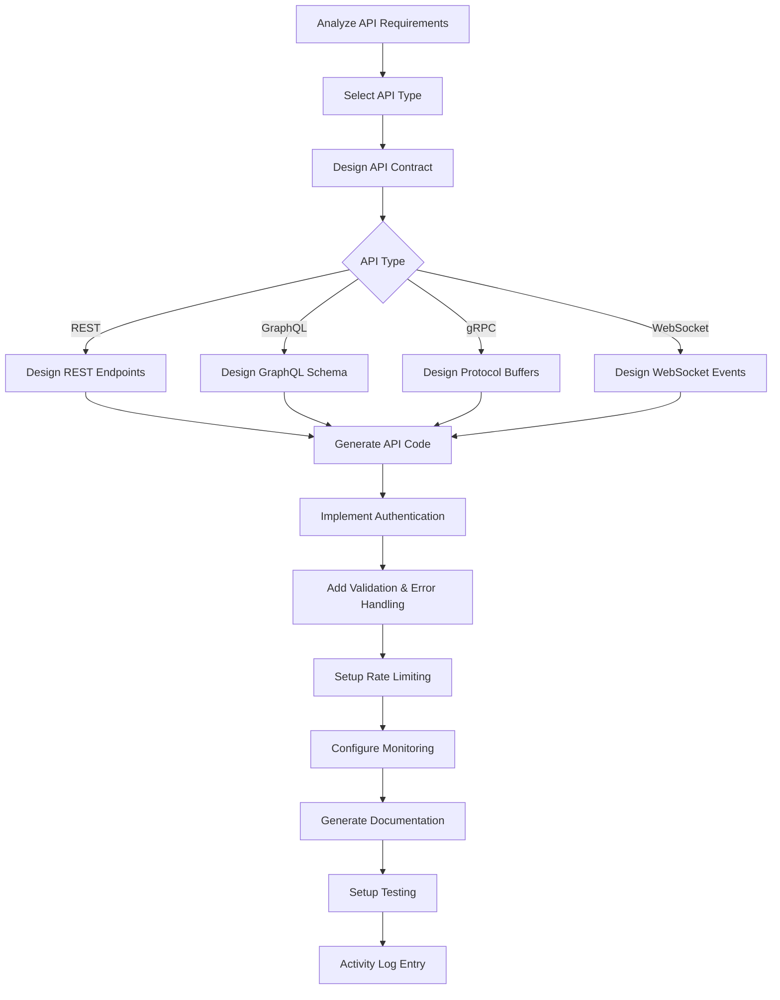

# api-development.skill

**Target Agent**: tech-lead-orchestrator
**Purpose**: Dynamic API development with intelligent contract generation, automated documentation, and comprehensive testing.

## API Configuration
```yaml
API Type: {{api-type}}  # rest/graphql/grpc/websocket
Framework: {{api-framework}}
Development Mode: {{dev-mode}}  # design/implementation/optimization
Authentication: {{auth-method}}
Documentation: {{doc-generator}}
```

## API Development Matrix
| Development Type | Trigger Condition | Priority | Auto-Generate |
|---|---|---|---|
| **REST API** | HTTP endpoints needed | **HIGH** | 🌐 |
| **GraphQL API** | Flexible queries required | MEDIUM | 🔍 |
| **gRPC API** | High-performance internal APIs | MEDIUM | ⚡ |
| **WebSocket API** | Real-time communication | MEDIUM | 🔌 |
| **API Gateway** | Multiple service orchestration | MEDIUM | 🚪 |

## Required Parameters
| Parameter | Description | Example |
|---|---|---|
| `task_reference` | Task ID or slug | `2025-demo` |
| `api_goal` | Primary API objective | `Build user management REST API` |
| `api_specification` | API specification or contract | `openapi-3.0, graphql-schema` |
| `endpoints_required` | Required API endpoints | `users, auth, profiles, preferences` |
| `performance_targets` | Performance requirements | `response_time<100ms, throughput>1000rps` |

## Optional Parameters
- `api_versioning` - API versioning strategy
- `rate_limiting` - Rate limiting and throttling requirements
- `monitoring_requirements` - API monitoring and observability
- `security_requirements` - Security standards and compliance
- `testing_requirements` - Testing strategy and coverage requirements

## Dynamic API Engine


## Intelligent API Generation
```yaml
API Templates:
  {{api-type}}/{{framework}}:
    Contract Definition: {{contract-template}}
    Implementation Structure: {{implementation-template}}
    Authentication Layer: {{auth-template}}
    Validation Logic: {{validation-template}}
    Error Handling: {{error-handling-template}}

Auto-Generated Components:
  - Endpoints/Resolvers: {{endpoint-count}} endpoints/resolvers
  - Models/Schemas: {{model-count}} data models/schemas
  - Authentication: {{auth-integration}} auth implementation
  - Validation: {{validation-rules}} validation rules
  - Error Handling: {{error-handlers}} error handlers
  - Documentation: {{doc-pages}} pages of documentation

API Features:
  - Request Validation: {{validation-status}}
  - Response Serialization: {{serialization-status}}
  - Error Formatting: {{error-format-status}}
  - Logging: {{logging-status}}
  - Metrics Collection: {{metrics-status}}
  - Health Checks: {{health-check-status}}
```

## REST API Templates
### OpenAPI Specification
```yaml
REST API Configuration:
  Specification: {{openapi-version}}
  Base Path: {{base-path}}
  Versioning: {{versioning-strategy}}
  Media Types: {{media-types}}

Auto-Generated Endpoints:
  GET: {{get-endpoints}}
  POST: {{post-endpoints}}
  PUT: {{put-endpoints}}
  DELETE: {{delete-endpoints}}
  PATCH: {{patch-endpoints}}

Features:
  - Path Parameters: {{path-params}}
  - Query Parameters: {{query-params}}
  - Request Bodies: {{request-bodies}}
  - Response Schemas: {{response-schemas}}
  - Error Responses: {{error-responses}}
```

### Controller Implementation
```yaml
Controller Structure:
  Framework: {{controller-framework}}
  Dependency Injection: {{di-pattern}}
  Middleware Stack: {{middleware-stack}}
  Error Handling: {{error-handling-pattern}}

Auto-Generated Controllers:
  - Controllers: {{controller-count}} controllers
  - Services: {{service-count}} services
  - Repositories: {{repository-count}} repositories
  - DTOs: {{dto-count}} data transfer objects
  - Mappers: {{mapper-count}} object mappers
```

## GraphQL API Templates
### Schema Design
```yaml
GraphQL Configuration:
  Schema Definition: {{schema-definition}}
  Resolvers: {{resolver-pattern}}
  Subscriptions: {{subscription-support}}
  Federation: {{federation-support}}

Auto-Generated Schema:
  - Query Types: {{query-type-count}} query types
  - Mutation Types: {{mutation-type-count}} mutation types
  - Subscription Types: {{subscription-type-count}} subscription types
  - Custom Scalars: {{scalar-count}} custom scalars
  - Interfaces: {{interface-count}} interfaces
  - Unions: {{union-count}} unions
```

### Resolver Implementation
```yaml
Resolver Structure:
  Framework: {{graphql-framework}}
  Data Sources: {{data-sources}}
  Caching Strategy: {{caching-strategy}}
  Authorization: {{authz-implementation}}

Auto-Generated Resolvers:
  - Query Resolvers: {{query-resolver-count}} resolvers
  - Mutation Resolvers: {{mutation-resolver-count}} resolvers
  - Subscription Resolvers: {{subscription-resolver-count}} resolvers
  - Field Resolvers: {{field-resolver-count}} resolvers
```

## gRPC API Templates
### Protocol Buffers
```yaml
gRPC Configuration:
  Proto Version: {{proto-version}}
  Services: {{service-count}} services
  Messages: {{message-count}} messages
  Streaming: {{streaming-support}}

Auto-Generated Proto:
  - Service Definitions: {{service-def-count}} services
  - Message Types: {{message-type-count}} message types
  - Enum Types: {{enum-type-count}} enums
  - Field Options: {{field-option-count}} field options
```

### Service Implementation
```yaml
Service Structure:
  Framework: {{grpc-framework}}
  Interceptors: {{interceptor-stack}}
  Error Handling: {{grpc-error-handling}}
  Metrics: {{grpc-metrics}}

Auto-Generated Services:
  - Service Implementations: {{service-impl-count}} services
  - Client Stubs: {{client-stub-count}} client stubs
  - Server Setup: {{server-config}} server configuration
```

## Output Templates
### API Development Summary
```
API Development Summary
Goal: {{api_goal}}
API Type: {{api_type}} {{framework}}
Timestamp: {{completion-time}}

Generated API:
🌐 Endpoints/Resolvers: {{endpoint-count}} endpoints/resolvers
📝 Models/Schemas: {{model-count}} data models/schemas
🔐 Authentication: {{auth-method}} authentication implemented
✅ Validation: {{validation-rules}} validation rules
⚠️ Error Handling: {{error-handlers}} error handlers

API Features:
📚 Documentation: {{doc-pages}} pages generated
🔍 API Explorer: {{api-explorer-status}} API explorer
📊 Monitoring: {{monitoring-status}} monitoring configured
⚡ Rate Limiting: {{rate-limiting-status}} rate limiting
🏥 Health Checks: {{health-check-status}} health checks
📈 Metrics: {{metrics-count}} metrics collected

Performance Metrics:
⚡ Response Time: {{avg-response-time}}ms
📈 Throughput: {{throughput}} requests/sec
🔥 CPU Usage: {{cpu-usage}}%
💾 Memory Usage: {{memory-usage}}MB
📊 Error Rate: {{error-rate}}%
⬆️ Uptime: {{uptime}}%

Security Features:
🔐 Authentication: {{auth-implementation}}
🛡️ Authorization: {{authz-implementation}}
🔒 HTTPS/TLS: {{tls-status}}
🚨 Rate Limiting: {{rate-limit-status}}
📝 Audit Logging: {{audit-logging-status}}

Testing Coverage:
🧪 Unit Tests: {{unit-test-coverage}}% coverage
🔗 Integration Tests: {{integration-test-count}} integration tests
📊 Contract Tests: {{contract-test-coverage}}% contract coverage
👁️ E2E Tests: {{e2e-test-count}} end-to-end tests

API Documentation:
📚 Generated Docs: {{doc-pages}} pages
🔍 Interactive Docs: {{interactive-docs}} interactive documentation
📖 Examples: {{example-count}} usage examples
🎯 SDK Generation: {{sdk-count}} SDKs generated

Next Actions:
- {{next-action-1}} (Owner: {{owner}})
- {{next-action-2}} (Owner: {{owner}})
```

### Rolling Summary Update
```
Context: {{api-name}} API completed with {{performance-level}} performance and {{security-level}} security
Facts: {{endpoint-count}} endpoints, {{throughput}} rps throughput, {{test-coverage}}% test coverage
Decisions: {{api-decisions}} made for scalability and security
Risks: {{api-risks}} identified and mitigation strategies implemented
Next: Deploy to {{deployment-environment}} and monitor API metrics
```

## API Gateway Templates
### Gateway Configuration
```yaml
Gateway Setup:
  Gateway Provider: {{gateway-provider}}
  Route Configuration: {{route-config}}
  Load Balancing: {{load-balancing-strategy}}
  Circuit Breaking: {{circuit-breaker-config}}

Features:
  - API Composition: {{composition-status}}
  - Request Routing: {{routing-status}}
  - Rate Limiting: {{gateway-rate-limiting}}
  - Authentication: {{gateway-auth}}
  - Monitoring: {{gateway-monitoring}}
```

## Dynamic Quality Gates
```yaml
API Standards:
  Response Time: "<{{max-response-time}}ms"
  Throughput: ">{{min-throughput}} rps"
  Error Rate: "<{{max-error-rate}}%"
  Documentation Coverage: "100%"
  Test Coverage: ">{{min-test-coverage}}%"

Auto-Quality Checks:
  - Contract Validation: {{contract-validation}}
  - Performance Testing: {{performance-testing}}
  - Security Scanning: {{security-scanning}}
  - Documentation Generation: {{doc-generation}}
```

## Quality Standards
- **📚 Contract-First**: API contract defined before implementation
- **🔒 Security First**: Authentication, authorization, and encryption
- **⚡ Performance Optimized**: Efficient response times and throughput
- **📊 Well Monitored**: Comprehensive monitoring and observability
- **📖 Fully Documented**: Complete, interactive API documentation

## Dynamic Features
- **🤖 Smart Contract Generation**: AI-powered API contract creation
- **📚 Auto-Documentation**: Automatic API docs and interactive explorer
- **⚡ Performance Optimization**: Intelligent performance tuning and caching
- **🔒 Security Automation**: Automated security best practices implementation
- **📊 Usage Analytics**: Real-time API usage monitoring and analytics
- **🔄 Version Management**: Automated API versioning and deprecation

## Example Usage
```
task_reference: 2025-demo
api_goal: Build comprehensive user management API with real-time notifications
api_specification: openapi-3.0
endpoints_required: [users, auth, profiles, preferences, notifications]
performance_targets: [response_time<50ms, throughput>2000rps, availability>99.9%]
api_versioning: [url-versioning, header-versioning]
rate_limiting: [1000req/min-per-user, 10000req/min-global]
monitoring_requirements: [metrics, logging, tracing, alerting]
security_requirements: [jwt-auth, oauth2, rate-limiting, input-validation]
testing_requirements: [unit, integration, contract, performance, security]
```

## Success Criteria
- API contract fully implemented and compliant
- All performance targets achieved and monitored
- Security requirements fully implemented
- Comprehensive test coverage achieved
- Complete documentation generated and accessible
- Monitoring and observability configured
- Ready for production deployment