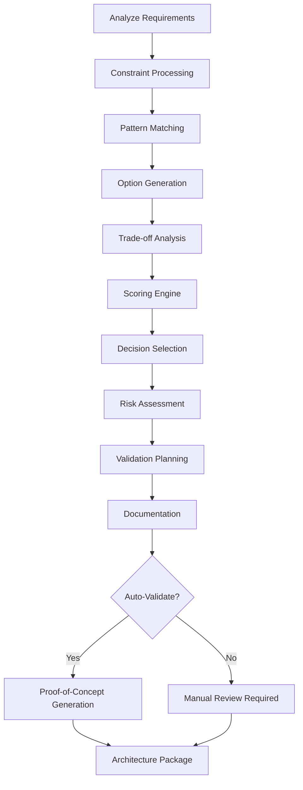

# architect-plan.skill

**Target Agent**: architect-orchestrator
**Purpose**: Dynamic architecture planning with intelligent decision support and automated trade-off analysis.

## Dynamic Architecture Configuration
```yaml
Planning Mode: {{planning-type}}  # greenfield/evolution/optimization
Complexity Level: {{complexity-score}}/10
Auto-Generation: {{auto-gen-enabled}}
Decision Framework: {{decision-framework}}
```

## Architecture Decision Engine
| Decision Type | Trigger Condition | Priority | Auto-Suggest |
|---|---|---|---|
| **Pattern Selection** | Architecture gaps identified | **HIGH** | 🎯 |
| **Technology Choice** | Stack decisions needed | **HIGH** | 🔧 |
| **Integration Design** | Service boundaries required | MEDIUM | 🔗 |
| **Risk Assessment** | Complexity > threshold | MEDIUM | ⚠️ |
| **Performance Planning** | NFRs specified | **HIGH** | ⚡ |

## Required Parameters
| Parameter | Description | Example |
|---|---|---|
| `task_reference` | Task ID or slug | `20251013-onboarding-funnel` |
| `architecture_goal` | Primary objective | `Select resilient KYC document processing pipeline` |
| `constraints` | Technical/business limits | `GDPR storage, <200ms p95, vendor SLA 1s` |
| `quality_targets` | Performance/reliability goals | `p95 < 150ms, 99.9% availability` |
| `complexity_factor` | Architecture complexity (1-10) | `7` |

## Optional Parameters
- `decision_weights` - Priority factors for decisions
- `pattern_library` - Available architecture patterns
- `technology_stack` - Preferred/constrained technologies
- `integration_patterns` - Known integration approaches

## Dynamic Architecture Generator


## Intelligent Decision Framework
```yaml
Decision Scoring:
  Technical Fit (30%): {{technical-fit-score}}
  Business Impact (25%): {{business-impact-score}}
  Implementation Risk (20%): {{risk-score}}
  Operational Complexity (15%): {{ops-complexity-score}}
  Future Proofing (10%): {{future-proof-score}}

Pattern Recommendations:
  Based on: {{analysis-factors}}
  Confidence: {{confidence-level}}%
  Alternatives: {{alternative-patterns}}

Auto-Generated Decisions:
  - {{decision-1}} (Score: {{score}}, Rationale: {{reasoning}})
  - {{decision-2}} (Score: {{score}}, Rationale: {{reasoning}})
```

## Output Templates
### Architecture Decision Package
```
Architecture Decision Summary
Goal: {{architecture-goal}}
Timestamp: {{decision-time}}
Complexity: {{complexity-factor}}/10
Confidence: {{confidence-level}}%

Recommended Approach:
🏗️ Pattern: {{selected-pattern}} (Fit: {{fit-score}}%)
🔧 Technology Stack: {{tech-stack}}
🔗 Integration Strategy: {{integration-approach}}
⚡ Performance Design: {{performance-approach}}

Key Decisions:
ARCH-{{sequence}}: {{decision-1}} (Rationale: {{reasoning}})
ARCH-{{sequence}}: {{decision-2}} (Rationale: {{reasoning}})

Trade-off Analysis:
Option A - {{option-a}}:
  Pros: {{pros}}, Cons: {{cons}}, Score: {{score}}
Option B - {{option-b}}:
  Pros: {{pros}}, Cons: {{cons}}, Score: {{score}}

Risk Assessment:
🔴 High Risk: {{high-risks}}
🟠 Medium Risk: {{medium-risks}}
🟡 Low Risk: {{low-risks}}

Validation Required:
- {{validation-1}} (Success: {{criteria}})
- {{validation-2}} (Success: {{criteria}})

Next Actions:
- {{action-1}} (Owner: {{owner}}, Due: {{date}})
- {{action-2}} (Owner: {{owner}}, Due: {{date}})
```

### Rolling Summary Update
```
Context: Architecture approach selected for {{problem-domain}}
Facts: Pattern {{selected-pattern}} chosen, {{key-deisions}} documented
Decisions: Architecture decisions {{decision-ids}} approved with {{confidence}} confidence
Risks: {{risk-count}} risks identified, mitigation plans in place
Next: Begin {{implementation-phase}} with {{next-steps}}
```

## Dynamic Quality Gates
```yaml
Architecture Validation:
  Pattern Completeness: 100%
  Constraint Compliance: 100%
  Decision Rationale: Clear and documented
  Risk Assessment: Comprehensive with mitigation
  Performance Planning: Quantified NFRs defined

Auto-Approval Criteria:
  Confidence ≥ 90%: ✅ Auto-approve
  Confidence 70-89%: 🔍 Review required
  Confidence < 70%: ❌ More analysis needed
```

## Quality Standards
- **🎯 Evidence-Based Decisions**: All decisions supported by analysis
- **📊 Quantified Trade-offs**: Measurable comparison of options
- **⚠️ Proactive Risk Management**: Identify and mitigate risks early
- **🔄 Continuous Validation**: Test assumptions through proof-of-concepts
- **📋 Clear Documentation**: Decision rationale and trade-offs documented

## Dynamic Features
- **🤖 Pattern Recognition**: Auto-suggest architecture patterns based on requirements
- **📊 Smart Scoring**: Intelligent evaluation of architecture options
- **⚡ Risk Prediction**: Proactive identification of potential issues
- **🔗 Integration Planning**: Automated service boundary design
- **📈 Performance Modeling**: Predict performance characteristics

## Example Usage
```
task_reference: 20251013-onboarding-funnel
architecture_goal: Select resilient architecture for automated KYC document processing
constraints: [GDPR storage, <200ms p95, vendor SLA 1s]
quality_targets: [p95 < 150ms, 99.9% availability]
complexity_factor: 7
decision_weights: [technical: 0.3, business: 0.35, risk: 0.2, ops: 0.15]
pattern_library: [microservices, event-driven, saga]
technology_stack: [node.js, postgres, redis, kafka]
```

## Success Criteria
- Architecture approach selected with confidence ≥ 80%
- All constraints addressed in design
- Performance targets quantified and achievable
- Risks identified with mitigation strategies
- Clear implementation path defined
- Validation plan established with success criteria