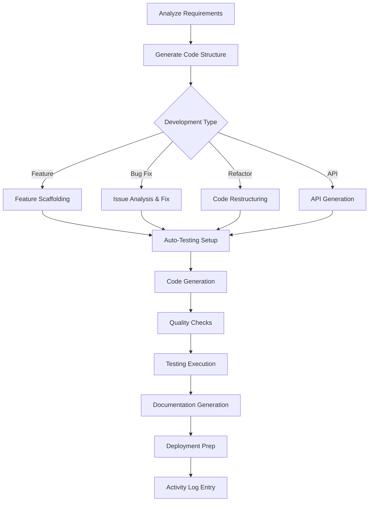

# code-development.skill

**Target Agent**: tech-lead-orchestrator
**Purpose**: Dynamic code development with intelligent scaffolding, automated testing, and best practices enforcement.

## Dynamic Development Configuration
```yaml
Development Mode: {{dev-mode}}  # feature/bugfix/refactor/prototype
Language Stack: {{language-stack}}
Framework: {{framework-version}}
Auto-Testing: {{auto-test-enabled}}
Code Generation: {{code-gen-enabled}}
```

## Development Matrix
| Development Type | Trigger Condition | Priority | Auto-Generate |
|---|---|---|---|
| **Feature Development** | New functionality required | **HIGH** | 🚀 |
| **Bug Fixing** | Issues identified | **HIGH** | 🔧 |
| **Refactoring** | Code quality improvement | MEDIUM | ♻️ |
| **API Development** | Service interfaces needed | **HIGH** | 🔌 |
| **Database Changes** | Data model updates | MEDIUM | 🗄️ |

## Required Parameters
| Parameter | Description | Example |
|---|---|---|
| `task_reference` | Task ID or slug | `2025-demo` |
| `development_goal` | Primary development objective | `Implement user authentication service` |
| `component_type` | Type of component to create | `microservice, library, ui-component` |
| `tech_stack` | Technology requirements | `node.js, typescript, express, postgres` |
| `testing_level` | Required testing coverage | `unit, integration, e2e` |

## Optional Parameters
- `code_patterns` - Preferred coding patterns/architecture
- `api_spec` - API specification or contract requirements
- `database_schema` - Database structure requirements
- `performance_targets` - Performance requirements
- `security_requirements` - Security constraints and standards

## Dynamic Development Engine


## Intelligent Code Generation
```yaml
Code Templates:
  {{language}}/{{framework}}:
    Component Structure: {{template-type}}
    Testing Setup: {{test-framework}}
    Documentation: {{doc-style}}
    CI/CD Integration: {{pipeline-config}}

Auto-Generated Features:
  - Boilerplate code: {{boilerplate-status}}
  - Error handling: {{error-handling-pattern}}
  - Logging: {{logging-implementation}}
  - Configuration: {{config-management}}
  - Health checks: {{health-check-setup}}
  - API documentation: {{api-docs-status}}

Quality Enforcement:
  - Linting rules: {{linting-config}}
  - Code formatting: {{formatting-rules}}
  - Security scanning: {{security-scan-enabled}}
  - Performance profiling: {{profiling-enabled}}
```

## Output Templates
### Development Summary
```
Code Development Summary
Goal: {{development-goal}}
Component Type: {{component-type}}
Tech Stack: {{tech-stack}}
Timestamp: {{completion-time}}

Generated Structure:
📁 {{project-structure}}
  📄 {{main-files}}
  📁 {{test-directories}}
  📁 {{config-files}}
  📁 {{docs-directories}}

Code Quality Metrics:
- Lines of Code: {{loc}}
- Test Coverage: {{coverage}}%
- Complexity Score: {{complexity}}/10
- Security Score: {{security-score}}/10
- Performance Score: {{performance-score}}/10

Implemented Features:
✅ {{feature-1}} (Tests: {{test-count}}, Coverage: {{coverage}}%)
✅ {{feature-2}} (Tests: {{test-count}}, Coverage: {{coverage}}%)

Auto-Generated Components:
🔧 {{component-1}} (Type: {{type}})
🔧 {{component-2}} (Type: {{type}})

Quality Checks:
🔍 Linting: {{linting-result}}
🛡️ Security Scan: {{security-result}}
⚡ Performance Check: {{performance-result}}
📊 Test Results: {{test-summary}}

Next Steps:
- {{next-action-1}} (Owner: {{owner}})
- {{next-action-2}} (Owner: {{owner}})
```

### Rolling Summary Update
```
Context: {{component-name}} development completed with {{quality-level}} quality
Facts: {{features-implemented}} implemented, {{test-coverage}}% test coverage
Decisions: {{key-decisions}} made during development
Risks: {{development-risks}} identified and mitigated
Next: Proceed to {{next-phase}} with {{next-steps}}
```

## Development Templates
### API Development
```yaml
API Template:
  Framework: {{api-framework}}
  Authentication: {{auth-method}}
  Validation: {{validation-library}}
  Documentation: {{doc-generator}}
  Testing: {{api-testing-tools}}

Auto-Generated Endpoints:
  GET: {{get-endpoints}}
  POST: {{post-endpoints}}
  PUT: {{put-endpoints}}
  DELETE: {{delete-endpoints}}

Quality Features:
  - Request validation: {{validation-status}}
  - Error handling: {{error-handling-status}}
  - Rate limiting: {{rate-limit-status}}
  - Logging: {{logging-status}}
  - Monitoring: {{monitoring-status}}
```

### Database Development
```yaml
Database Template:
  Type: {{database-type}}
  ORM: {{orm-library}}
  Migrations: {{migration-system}}
  Seeding: {{seed-data-setup}}
  Testing: {{db-testing-strategy}}

Auto-Generated Components:
  - Schema: {{schema-status}}
  - Models: {{models-status}}
  - Migrations: {{migration-count}}
  - Seeds: {{seed-status}}
  - Tests: {{db-test-status}}
```

### Frontend Development
```yaml
Frontend Template:
  Framework: {{frontend-framework}}
  State Management: {{state-management}}
  Styling: {{styling-solution}}
  Testing: {{frontend-testing}}
  Build: {{build-system}}

Auto-Generated Components:
  - Components: {{component-count}}
  - Pages: {{page-count}}
  - Services: {{service-count}}
  - Hooks/Utils: {{hook-count}}
  - Tests: {{test-count}}
```

## Dynamic Quality Gates
```yaml
Development Standards:
  Code Coverage: ">{{min-coverage}}%"
  Complexity Score: "<{{max-complexity}}"
  Security Score: ">{{min-security}}/10"
  Performance Score: ">{{min-performance}}/10"

Auto-Approval:
  All Gates Pass: ✅ Auto-approve development
  Minor Issues: 🔍 Review required
  Major Issues: ❌ Revisions needed

Continuous Integration:
  - Build Status: {{build-status}}
  - Test Results: {{test-results}}
  - Quality Gates: {{gate-results}}
  - Deployment Ready: {{deployment-status}}
```

## Quality Standards
- **🎯 Requirements Compliance**: Code meets all specified requirements
- **📊 Quality Metrics**: Maintain high code quality scores
- **🧪 Comprehensive Testing**: Automated testing at all levels
- **📚 Documentation**: Auto-generated and maintained documentation
- **🔄 Continuous Integration**: Seamless CI/CD integration

## Dynamic Features
- **🤖 Smart Scaffolding**: Generate project structure based on requirements
- **⚡ Code Generation**: Auto-generate boilerplate and common patterns
- **🧪 Test Generation**: Automatically generate unit and integration tests
- **📊 Quality Analysis**: Real-time code quality assessment
- **📚 Auto-Documentation**: Generate API docs and code documentation
- **🔧 Best Practices Enforcement**: Automatically apply coding standards

## Example Usage
```
task_reference: 2025-demo
development_goal: Implement user authentication microservice
component_type: microservice
tech_stack: [node.js, typescript, express, postgres, redis]
testing_level: [unit, integration, contract]
code_patterns: [clean-architecture, dependency-injection]
api_spec: openapi-3.0
performance_targets: [response_time<200ms, throughput>1000tps]
security_requirements: [jwt-auth, rate-limiting, input-validation]
```

## Success Criteria
- Development goal fully implemented and tested
- Code quality scores meet minimum thresholds
- Test coverage meets or exceeds targets
- All auto-generated components working correctly
- Documentation complete and accurate
- Ready for integration and deployment