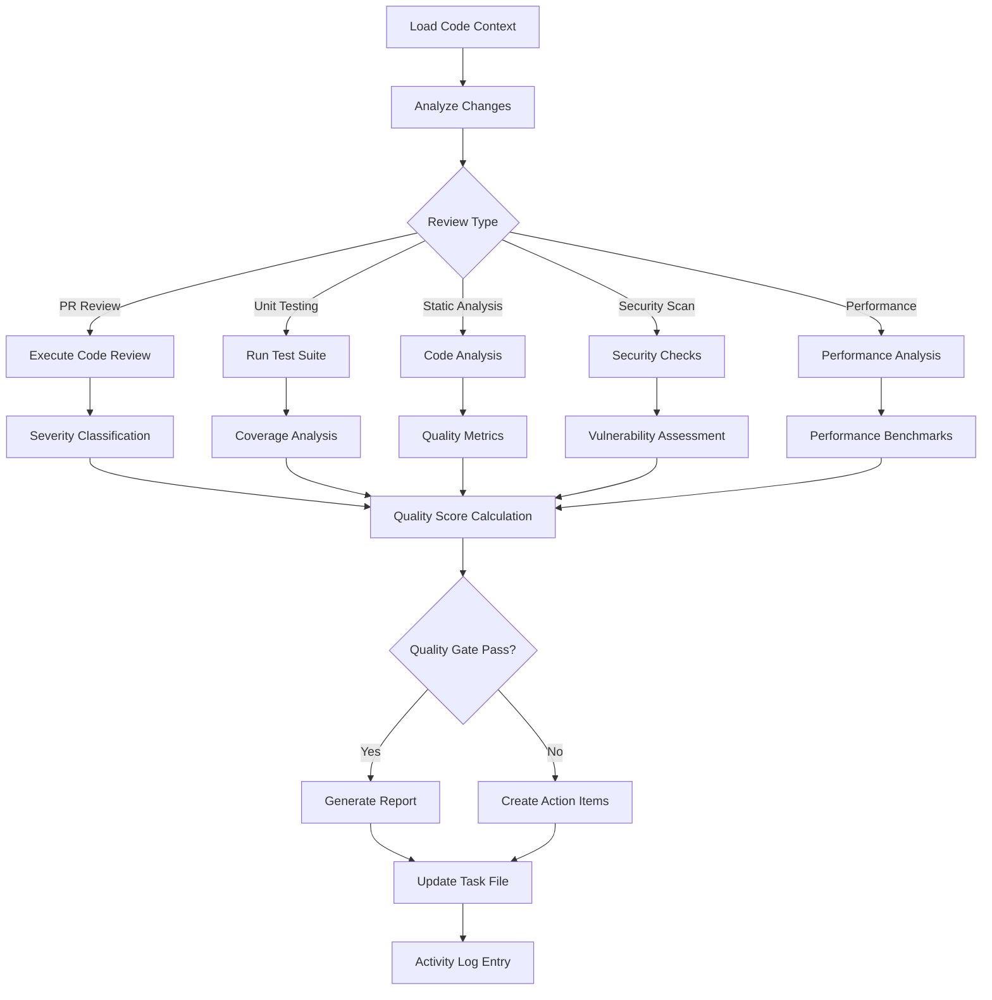

# code-quality.skill

**Target Agent**: tech-lead-orchestrator, qa-orchestrator
**Purpose**: Comprehensive code quality evaluation with dynamic analysis and automated scoring.

## Dynamic Quality Configuration
```yaml
Quality Framework:
  Review Mode: {{review-type}}  # PR/branch/commit
  Auto-Scan: {{auto-scan-enabled}}
  Quality Score: {{current-score}}/100
  Standards: {{coding-standards-version}}
```

## Quality Check Matrix
| Check Type | Trigger | Priority | Auto-Execute |
|---|---|---|---|
| **Code Review** | Pull requests, changes | **HIGH** | ✅ |
| **Unit Testing** | Code commits, builds | **HIGH** | ✅ |
| **Static Analysis** | Code changes, scheduled | MEDIUM | 🤖 |
| **Security Scan** | Dependencies, commits | **HIGH** | 🛡️ |
| **Performance Check** | Critical paths, changes | MEDIUM | ⚡ |

## Required Parameters
| Parameter | Description | Example |
|---|---|---|
| `task_reference` | Task ID or slug | `2025-demo` |
| `review_target` | PR/branch/commit identifier | `PR#128` |
| `change_scope` | What changed and impact | `Adds Kafka producer + Terraform` |
| `quality_focus` | Areas to emphasize | `security,performance,correctness` |

## Optional Parameters
- `depth_level` - Analysis depth (shallow/standard/deep)
- `exclude_patterns` - Files/directories to skip
- `custom_rules` - Additional quality rules
- `baseline_comparison` - Compare against previous metrics

## Dynamic Quality Scoring
```yaml
Quality Score Breakdown:
  Code Structure (25%): {{structure-score}}
  Test Coverage (20%): {{coverage-score}}
  Security (20%): {{security-score}}
  Performance (15%): {{performance-score}}
  Documentation (10%): {{docs-score}}
  Best Practices (10%): {{practices-score}}

Total Score: {{total-score}}/100
Grade: {{grade}} # A/B/C/D/F
```

## Execution Workflow


## Issue Classification System
```yaml
Severity Levels:
  Blocker (🔴):
    - Security vulnerabilities
    - Breaking changes
    - Test failures in critical paths
    - Performance regressions > 50%

  Major (🟠):
    - Code smells in critical components
    - Missing test coverage in important areas
    - Documentation gaps in APIs
    - Performance regressions 20-50%

  Minor (🟡):
    - Style inconsistencies
    - Minor optimizations needed
    - Documentation improvements
    - Performance regressions < 20%

  Note (💡):
    - Suggestions for improvement
    - Best practice recommendations
    - Code organization tips
```

## Output Templates
### Code Quality Report
```
Code Quality Analysis
Target: {{review-target}}
Scope: {{change-scope}}
Timestamp: {{analysis-time}}
Quality Score: {{score}}/100 (Grade: {{grade}})

Findings by Severity:
🔴 Blocker: {{blocker-count}}
  - {{issue-1}} (File: {{file}}, Line: {{line}})
  - {{issue-2}} (File: {{file}}, Line: {{line}})

🟠 Major: {{major-count}}
  - {{issue-1}} (File: {{file}}, Impact: {{impact}})
  - {{issue-2}} (File: {{file}}, Impact: {{impact}})

🟡 Minor: {{minor-count}}
  - {{suggestion-1}} (File: {{file}})
  - {{suggestion-2}} (File: {{file}})

💡 Notes: {{note-count}}
  - {{recommendation-1}} (File: {{file}})
  - {{recommendation-2}} (File: {{file}})

Test Coverage: {{coverage}}% (Target: {{target-coverage}}%)
Security Issues: {{security-count}} ({{severity-breakdown}})
Performance Impact: {{performance-assessment}}

Recommendation: {{go-no-go-decision}}
Next Actions: {{action-items-with-owners}}
```

### Rolling Summary Update
```
Context: {{updated-code-quality-context}}
Facts: Quality score {{score}}/100, {{blocker-count}} blockers, {{coverage}}% coverage
Decisions: {{approval-rejection-decision}} with rationale
Risks: {{code-quality-risks}} with mitigation plans
Next: {{immediate-quality-actions}}
```

## Dynamic Quality Gates
```yaml
Gate Configuration:
  Quality Score: ">{{min-score}}/100"
  Test Coverage: ">{{min-coverage}}%"
  Security Issues: "{{max-security-issues}}"
  Performance Regression: "<{{max-regression}}%"
  Documentation Coverage: ">{{min-docs}}%"

Auto-Approval:
  Score ≥ 90: ✅ Auto-approve
  Score 80-89: 🔍 Requires review
  Score < 80: ❌ Requires changes
```

## Quality Standards
- **📊 Consistent Scoring**: Standardized quality metrics across all reviews
- **🎯 Risk-Based Focus**: Prioritize issues based on business impact
- **🔄 Continuous Improvement**: Track quality trends over time
- **📋 Evidence-Based**: All findings supported by specific evidence
- **🤖 Intelligent Automation**: Smart suggestions and auto-fixes where possible

## Dynamic Features
- **🎯 Smart Issue Detection**: AI-powered identification of potential issues
- **📈 Trend Analysis**: Track quality metrics over time
- **🔧 Auto-Fix Suggestions**: Automated recommendations for common issues
- **📊 Custom Dashboards**: Quality metrics visualization
- **🔄 Continuous Learning**: Improve detection based on feedback

## Example Usage
```
task_reference: 2025-demo
review_target: PR#128
change_scope: Adds Kafka producer and Terraform topic module
quality_focus: [security, performance, correctness]
depth_level: standard
exclude_patterns: [tests/**, docs/**]
baseline_comparison: true
```

## Success Criteria
- Quality score meets minimum thresholds
- All blocker and major issues addressed
- Test coverage meets or exceeds targets
- Security vulnerabilities resolved or documented
- Clear approval/rejection decision with rationale
- Actionable next steps provided