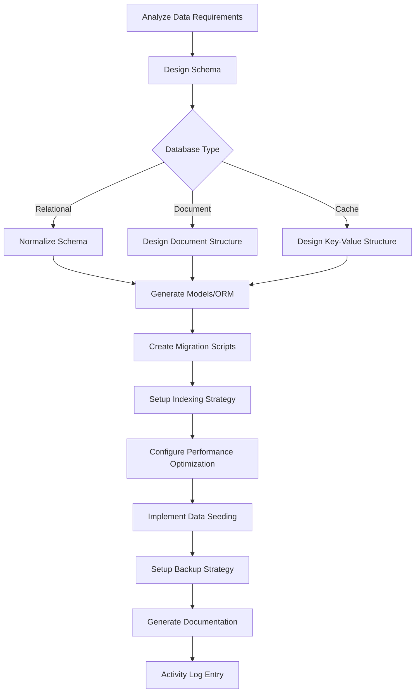

# database-development.skill

**Target Agent**: tech-lead-orchestrator
**Purpose**: Dynamic database development with intelligent schema design, automated migrations, and performance optimization.

## Database Configuration
```yaml
Database Type: {{db-type}}  # postgresql/mysql/mongodb/redis
Development Mode: {{db-mode}}  # design/migration/optimization
ORM Framework: {{orm-framework}}
Auto-Migration: {{migration-enabled}}
Performance Optimization: {{perf-optimization}}
```

## Database Development Matrix
| Development Type | Trigger Condition | Priority | Auto-Generate |
|---|---|---|---|
| **Schema Design** | New project/data model | **HIGH** | 🗄️ |
| **Migrations** | Schema changes required | **HIGH** | 🔄 |
| **Performance Optimization** | Slow queries identified | MEDIUM | ⚡ |
| **Data Seeding** | Test data needed | MEDIUM | 🌱 |
| **Backup Strategy** | Production deployment | **HIGH** | 💾 |

## Required Parameters
| Parameter | Description | Example |
|---|---|---|
| `task_reference` | Task ID or slug | `2025-demo` |
| `database_goal` | Primary database objective | `Design user management database schema` |
| `data_model` | Data model requirements | `user-auth, profiles, preferences` |
| `database_type` | Database technology | `postgresql, mongodb, redis` |
| `performance_requirements` | Performance targets | `query_time<100ms, concurrent_users>1000` |

## Optional Parameters
- `migration_strategy` - Migration approach (zero-downtime, blue-green)
- `indexing_strategy` - Index optimization requirements
- `backup_requirements` - Backup and recovery needs
- `scaling_requirements` - Scaling and partitioning strategy
- `security_constraints` - Data security and privacy requirements

## Dynamic Database Engine


## Intelligent Schema Generation
```yaml
Schema Templates:
  {{db-type}}/{{pattern-type}}:
    Table Structure: {{table-template}}
    Relationship Design: {{relationship-pattern}}
    Index Strategy: {{index-strategy}}
    Constraint Design: {{constraint-pattern}}

Auto-Generated Components:
  - Tables/Models: {{table-count}} tables/models
  - Relationships: {{relationship-count}} relationships
  - Indexes: {{index-count}} optimized indexes
  - Constraints: {{constraint-count}} constraints
  - Triggers: {{trigger-count}} triggers
  - Stored Procedures: {{procedure-count}} procedures

Performance Optimization:
  - Query Optimization: {{query-opt-status}}
  - Index Analysis: {{index-analysis-status}}
  - Connection Pooling: {{pooling-status}}
  - Caching Strategy: {{caching-status}}
  - Partitioning: {{partitioning-status}}
```

## Migration Templates
### Database Migrations
```yaml
Migration Framework: {{migration-tool}}
Migration Strategy: {{migration-strategy}}

Auto-Generated Migrations:
  - Initial Schema: {{initial-migration}}
  - Data Changes: {{data-migrations}}
  - Index Changes: {{index-migrations}}
  - Constraint Changes: {{constraint-migrations}}

Migration Features:
  - Rollback Support: {{rollback-support}}
  - Zero Downtime: {{zero-downtime-status}}
  - Data Validation: {{validation-status}}
  - Performance Impact: {{performance-impact}}
```

### ORM Integration
```yaml
ORM Configuration:
  Framework: {{orm-framework}}
  Models: {{model-count}} models generated
  Relationships: {{relationship-config}}
  Validations: {{validation-rules}}
  Migrations: {{orm-migrations}}

Auto-Generated Models:
  - Entity Models: {{entity-models}}
  - DTOs: {{dto-count}}
  - Repositories: {{repository-count}}
  - Services: {{service-count}}
  - Test Fixtures: {{fixture-count}}
```

## Performance Optimization
```yaml
Performance Analysis:
  Query Performance: {{query-analysis}}
  Index Efficiency: {{index-efficiency}}
  Connection Usage: {{connection-metrics}}
  Cache Hit Rate: {{cache-hit-rate}}

Auto-Optimization:
  - Index Recommendations: {{index-recs}}
  - Query Optimization: {{query-optimization}}
  - Connection Tuning: {{connection-tuning}}
  - Cache Configuration: {{cache-config}}
  - Partitioning Strategy: {{partitioning-strategy}}
```

## Output Templates
### Database Development Summary
```
Database Development Summary
Goal: {{database-goal}}
Database Type: {{db-type}} {{db-version}}
Timestamp: {{completion-time}}

Schema Design:
🗄️ Tables/Collections: {{table-count}} tables/collections
🔗 Relationships: {{relationship-count}} relationships defined
📊 Indexes: {{index-count}} optimized indexes
⚡ Performance: {{query-optimization}} queries optimized
🔐 Constraints: {{constraint-count}} constraints implemented

Generated Components:
📝 Models/Entities: {{model-count}} models generated
🔄 Migrations: {{migration-count}} migration scripts
🧪 Test Fixtures: {{fixture-count}} test fixtures created
📚 Documentation: {{doc-pages}} pages of documentation

Performance Metrics:
⚡ Average Query Time: {{avg-query-time}}ms
📈 Query Throughput: {{query-throughput}} queries/sec
💾 Storage Usage: {{storage-usage}}MB
🔗 Connection Pool: {{pool-usage}}/{{pool-max}} connections
🎯 Cache Hit Rate: {{cache-hit-rate}}%

Data Seeding:
🌱 Seed Data: {{seed-record-count}} records seeded
👥 Test Users: {{test-user-count}} test users
📊 Sample Data: {{sample-data-size}}MB of sample data

Backup & Recovery:
💾 Backup Strategy: {{backup-strategy}} configured
🔄 Recovery Point: {{rpo}} Recovery Point Objective
⏱️ Recovery Time: {{rto}} Recovery Time Objective
🔐 Encryption: {{encryption-status}} data at rest

Next Actions:
- {{next-action-1}} (Owner: {{owner}})
- {{next-action-2}} (Owner: {{owner}})
```

### Rolling Summary Update
```
Context: {{database-name}} database designed and implemented with {{performance-level}} performance
Facts: {{table-count}} tables, {{index-count}} indexes, {{query-throughput}} qps throughput
Decisions: {{db-decisions}} made for scalability and performance
Risks: {{db-risks}} identified and mitigation strategies implemented
Next: Monitor performance and optimize based on {{optimization-focus}}
```

## Database Templates
### User Management Database
```yaml
User Schema:
  Users Table: {{users-table-schema}}
  Profiles Table: {{profiles-table-schema}}
  Permissions Table: {{permissions-table-schema}}
  Sessions Table: {{sessions-table-schema}}

Features:
  - Authentication: {{auth-implementation}}
  - Authorization: {{authz-implementation}}
  - Password Security: {{password-security}}
  - Session Management: {{session-management}}
  - Audit Logging: {{audit-logging}}
```

### E-commerce Database
```yaml
E-commerce Schema:
  Products Table: {{products-table-schema}}
  Orders Table: {{orders-table-schema}}
  Inventory Table: {{inventory-table-schema}}
  Payments Table: {{payments-table-schema}}

Features:
  - Product Catalog: {{catalog-features}}
  - Order Processing: {{order-features}}
  - Inventory Management: {{inventory-features}}
  - Payment Processing: {{payment-features}}
  - Analytics Tracking: {{analytics-features}}
```

### Analytics Database
```yaml
Analytics Schema:
  Events Table: {{events-table-schema}}
  Aggregations Table: {{aggregations-table-schema}}
  Reports Table: {{reports-table-schema}}
  Metrics Table: {{metrics-table-schema}}

Features:
  - Event Tracking: {{event-tracking}}
  - Data Aggregation: {{data-aggregation}}
  - Report Generation: {{report-generation}}
  - Real-time Analytics: {{realtime-analytics}}
  - Data Retention: {{data-retention}}
```

## Dynamic Quality Gates
```yaml
Database Standards:
  Schema Normalization: {{normalization-level}}
  Query Performance: "<{{max-query-time}}ms"
  Index Efficiency: ">{{min-index-efficiency}}%"
  Data Integrity: {{integrity-checks}}
  Security Compliance: {{security-standards}}

Auto-Validation:
  Schema Validation: {{schema-validation}}
  Performance Benchmarks: {{performance-benchmarks}}
  Security Scanning: {{security-scan}}
  Data Quality: {{data-quality-checks}}
```

## Quality Standards
- **🗄️ Schema Design**: Proper normalization and relationship design
- **⚡ Performance Optimization**: Efficient queries and indexing
- **🔐 Security**: Proper authentication, authorization, and encryption
- **🔄 Migration Safety**: Safe, reversible database migrations
- **📊 Monitoring**: Comprehensive performance and health monitoring

## Dynamic Features
- **🤖 Smart Schema Design**: AI-powered normalization and relationship suggestions
- **⚡ Auto-Indexing**: Intelligent index recommendations and generation
- **🔄 Migration Management**: Automated migration generation and rollback
- **📊 Performance Tuning**: Automatic query optimization and index analysis
- **🔐 Security Hardening**: Automated security best practices implementation
- **📈 Capacity Planning**: Predictive scaling and resource optimization

## Example Usage
```
task_reference: 2025-demo
database_goal: Design scalable user management database for microservices
data_model: [user-auth, profiles, preferences, permissions, audit-logs]
database_type: [postgresql, redis]
performance_requirements: [query_time<50ms, concurrent_users>10000]
migration_strategy: zero-downtime
indexing_strategy: [performance-optimized, partial-indexes]
backup_requirements: [daily-backups, point-in-time-recovery]
security_constraints: [gdpr-compliant, encryption-at-rest, audit-logging]
```

## Success Criteria
- Database schema fully designed and implemented
- All performance targets achieved and monitored
- Migration strategy tested and validated
- Security requirements fully implemented
- Data seeding and test fixtures complete
- Documentation and monitoring configured