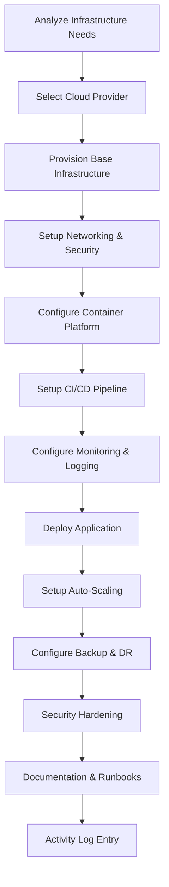

# devops-automation.skill

**Target Agent**: tech-lead-orchestrator
**Purpose**: Dynamic DevOps automation with intelligent infrastructure provisioning, CI/CD pipelines, and deployment strategies.

## DevOps Configuration
```yaml
Automation Level: {{automation-level}}  # basic/standard/advanced
Infrastructure: {{infra-type}}  # aws/azure/gcp/on-premise
Deployment Strategy: {{deployment-strategy}}
Monitoring Setup: {{monitoring-enabled}}
Security Posture: {{security-level}}
```

## Automation Matrix
| Automation Type | Trigger Condition | Priority | Auto-Execute |
|---|---|---|---|
| **Infrastructure Provisioning** | New project/environment | **HIGH** | 🏗️ |
| **CI/CD Pipeline** | Code repository setup | **HIGH** | 🔄 |
| **Containerization** | Application deployment | **HIGH** | 🐳 |
| **Monitoring Setup** | Service deployment | MEDIUM | 📊 |
| **Security Hardening** | Production deployment | **HIGH** | 🛡️ |

## Required Parameters
| Parameter | Description | Example |
|---|---|---|
| `task_reference` | Task ID or slug | `2025-demo` |
| `automation_goal` | Primary DevOps objective | `Setup complete CI/CD pipeline for microservices` |
| `infrastructure_needs` | Infrastructure requirements | `kubernetes-cluster, databases, load-balancer` |
| `deployment_targets` | Deployment environments | `dev, staging, production` |
| `monitoring_requirements` | Monitoring and alerting needs | `metrics, logs, uptime, performance` |

## Optional Parameters
- `security_compliance` - Security standards and compliance requirements
- `performance_sla` - Service level agreements and performance targets
- `disaster_recovery` - Backup and recovery requirements
- `scaling_strategy` - Auto-scaling and capacity planning
- `cost_optimization` - Budget and cost management requirements

## Dynamic Automation Engine


## Intelligent Infrastructure Generation
```yaml
Infrastructure Templates:
  {{cloud-provider}}/{{service-type}}:
    Compute: {{compute-instance-type}}
    Storage: {{storage-configuration}}
    Networking: {{network-setup}}
    Security: {{security-groups}}
    Monitoring: {{monitoring-stack}}

Auto-Provisioned Components:
  - Kubernetes Cluster: {{k8s-status}}
  - Load Balancer: {{lb-status}}
  - Database: {{db-status}}
  - Redis Cache: {{redis-status}}
  - Storage: {{storage-status}}
  - CDN: {{cdn-status}}

Security Automation:
  - SSL/TLS: {{ssl-status}}
  - WAF: {{waf-status}}
  - IAM Roles: {{iam-status}}
  - Network Security: {{network-security-status}}
  - Secrets Management: {{secrets-status}}
```

## CI/CD Pipeline Templates
### GitHub Actions
```yaml
Pipeline Configuration:
  Triggers: {{trigger-events}}
  Environments: {{deployment-environments}}
  Build Matrix: {{build-matrix}}
  Test Strategy: {{test-strategy}}
  Deployment Strategy: {{deploy-strategy}}

Pipeline Stages:
  - Source Checkout: {{checkout-stage}}
  - Dependency Installation: {{deps-stage}}
  - Code Quality Checks: {{quality-stage}}
  - Security Scanning: {{security-stage}}
  - Testing: {{test-stage}}
  - Build: {{build-stage}}
  - Container Registry Push: {{registry-stage}}
  - Deployment: {{deploy-stage}}
  - Health Checks: {{health-stage}}
  - Notifications: {{notification-stage}}
```

### GitLab CI/CD
```yaml
GitLab Pipeline:
  Stages: {{pipeline-stages}}
  Variables: {{env-variables}}
  Cache: {{cache-strategy}}
  Artifacts: {{artifact-management}}
  Runners: {{runner-configuration}}

Auto-Generated Jobs:
  - build: {{build-job-config}}
  - test: {{test-job-config}}
  - security: {{security-job-config}}
  - deploy_dev: {{dev-deploy-config}}
  - deploy_staging: {{staging-deploy-config}}
  - deploy_prod: {{prod-deploy-config}}
```

## Monitoring & Observability
```yaml
Monitoring Stack:
  Metrics: {{metrics-system}}  # Prometheus/Grafana
  Logging: {{logging-system}}  # ELK Stack/Fluentd
  Tracing: {{tracing-system}}  # Jaeger/Zipkin
  Alerting: {{alerting-system}}  # AlertManager/PagerDuty

Auto-Configured Dashboards:
  - System Metrics: {{system-dashboard}}
  - Application Metrics: {{app-dashboard}}
  - Error Tracking: {{error-dashboard}}
  - Performance Monitoring: {{perf-dashboard}}
  - Business Metrics: {{business-dashboard}}

Alert Rules:
  - High Error Rate: {{error-alert}}
  - High Response Time: {{latency-alert}}
  - Low Availability: {{availability-alert}}
  - Resource Usage: {{resource-alert}}
  - Security Events: {{security-alert}}
```

## Output Templates
### DevOps Automation Summary
```
DevOps Automation Summary
Goal: {{automation-goal}}
Infrastructure: {{infra-provider}} {{infra-type}}
Timestamp: {{completion-time}}

Provisioned Infrastructure:
☁️ Cloud Resources: {{resource-count}} resources provisioned
🏗️ Kubernetes: {{k8s-nodes}} nodes, {{k8s-pods}} max pods
🗄️ Databases: {{db-count}} databases configured
🔄 Load Balancers: {{lb-count}} load balancers active
📊 Monitoring: {{monitoring-stack}} fully configured

CI/CD Pipeline:
🔄 Pipeline: {{pipeline-status}} ({{pipeline-url}})
🧪 Automated Tests: {{test-coverage}}% coverage
🛡️ Security Scanning: {{security-scan-result}}
🚀 Deployment: {{deployment-strategy}} configured
📦 Container Registry: {{registry-status}}

Performance Metrics:
⚡ Response Time: {{avg-response-time}}ms
📈 Throughput: {{throughput}} requests/sec
🔧 Uptime: {{uptime}}%
💾 Storage Usage: {{storage-usage}}%
🖥️ CPU Usage: {{cpu-usage}}%

Security Posture:
🛡️ SSL/TLS: {{ssl-status}}
🔐 Access Control: {{access-control-status}}
🔍 Security Scanning: {{security-scan-frequency}}
🚨 Alerting: {{alerting-status}}

Automation Features:
🤖 Auto-Scaling: {{autoscaling-status}}
🔄 Rolling Updates: {{rolling-update-status}}
📊 Auto-Healing: {{healing-status}}
🚨 Auto-Alerts: {{alert-status}}

Next Actions:
- {{next-action-1}} (Owner: {{owner}})
- {{next-action-2}} (Owner: {{owner}})
```

### Rolling Summary Update
```
Context: {{infrastructure-name}} fully automated with {{automation-level}} automation
Facts: {{resource-count}} resources provisioned, CI/CD pipeline active, {{uptime}}% uptime
Decisions: {{infra-decisions}} made for scalability and security
Risks: {{operational-risks}} identified and mitigated
Next: Monitor performance and optimize based on {{metrics-focus}}
```

## Dynamic Deployment Strategies
```yaml
Deployment Strategies:
  Rolling: {{rolling-config}}
  Blue-Green: {{blue-green-config}}
  Canary: {{canary-config}}
  A/B Testing: {{ab-testing-config}}

Auto-Deployment Features:
  - Zero Downtime: {{zero-downtime-status}}
  - Rollback Capability: {{rollback-status}}
  - Health Checks: {{health-check-status}}
  - Traffic Shifting: {{traffic-shift-status}}
  - Feature Flags: {{feature-flag-status}}
```

## Quality Standards
- **🏗️ Infrastructure as Code**: All infrastructure codified and versioned
- **🔄 Automated Everything**: Manual processes eliminated where possible
- **📊 Comprehensive Monitoring**: Full observability stack configured
- **🛡️ Security First**: Security integrated throughout the pipeline
- **🚨 Proactive Alerting**: Intelligent alerts for meaningful events

## Dynamic Features
- **🤖 Intelligent Provisioning**: Auto-select optimal infrastructure configurations
- **🔄 Self-Healing Systems**: Automatically detect and recover from failures
- **📈 Predictive Scaling**: Scale based on traffic patterns and predictions
- **🛡️ Security Automation**: Continuous security scanning and compliance checking
- **💰 Cost Optimization**: Automatically optimize resource usage and costs
- **📊 Smart Monitoring**: AI-powered anomaly detection and alerting

## Example Usage
```
task_reference: 2025-demo
automation_goal: Setup complete CI/CD pipeline for microservices architecture
infrastructure_needs: [kubernetes-cluster, postgres-database, redis-cache, load-balancer]
deployment_targets: [dev, staging, production]
monitoring_requirements: [metrics, logs, traces, alerts]
security_compliance: [SOC2, GDPR, PCI-DSS]
performance_sla: [response_time<200ms, availability>99.9%]
scaling_strategy: [auto-scaling, predictive-scaling]
cost_optimization: [spot-instances, rightsizing, scheduled-scaling]
```

## Success Criteria
- Infrastructure fully provisioned and operational
- CI/CD pipeline working with automated deployments
- Monitoring and alerting configured and functional
- Security posture meets compliance requirements
- Performance targets achieved and monitored
- Documentation and runbooks complete and accessible