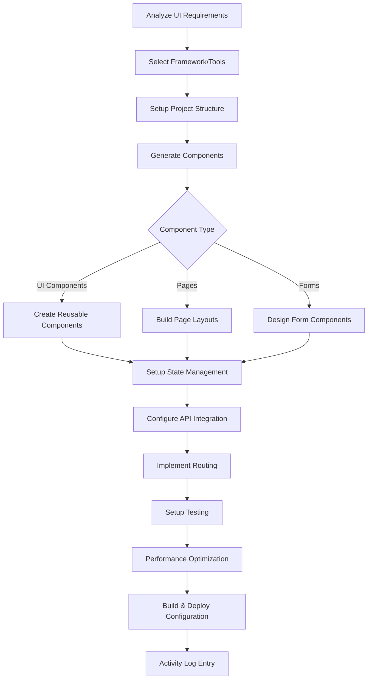

# frontend-development.skill

**Target Agent**: tech-lead-orchestrator
**Purpose**: Dynamic frontend development with intelligent component generation, automated testing, and performance optimization.

## Frontend Configuration
```yaml
Framework: {{frontend-framework}}  # react/vue/angular/nextjs
Development Mode: {{dev-mode}}  # component/page/application
Build System: {{build-system}}  # webpack/vite/parcel
Styling: {{styling-solution}}  # css/scss/tailwind/styled-components
Testing Framework: {{test-framework}}
```

## Frontend Development Matrix
| Development Type | Trigger Condition | Priority | Auto-Generate |
|---|---|---|---|
| **Component Development** | UI components needed | **HIGH** | 🧩 |
| **Page Development** | Complete pages required | **HIGH** | 📄 |
| **State Management** | Application state needed | MEDIUM | 🔄 |
| **API Integration** | Backend connectivity | **HIGH** | 🔌 |
| **Performance Optimization** | Slow loading/interaction | MEDIUM | ⚡ |

## Required Parameters
| Parameter | Description | Example |
|---|---|---|
| `task_reference` | Task ID or slug | `2025-demo` |
| `frontend_goal` | Primary frontend objective | `Build responsive user dashboard` |
| `component_types` | Required component types | `forms, tables, charts, navigation` |
| `framework_requirements` | Framework and tools needed | `react, typescript, tailwind, testing-library` |
| `performance_targets` | Performance requirements | `load_time<2s, lighthouse_score>90` |

## Optional Parameters
- `design_system` - Design system or component library
- `accessibility_requirements` - Accessibility standards and requirements
- `browser_support` - Browser compatibility requirements
- `internationalization` - i18n and localization needs
- `pwa_features` - Progressive Web App features

## Dynamic Frontend Engine


## Intelligent Component Generation
```yaml
Component Templates:
  {{framework}}/{{component-type}}:
    Structure: {{component-template}}
    Props Interface: {{props-interface}}
    State Management: {{state-pattern}}
    Styling: {{styling-pattern}}
    Testing: {{test-template}}

Auto-Generated Components:
  - UI Components: {{ui-component-count}} components
  - Form Components: {{form-component-count}} forms
  - Layout Components: {{layout-component-count}} layouts
  - Business Components: {{business-component-count}} components
  - Page Components: {{page-component-count}} pages

Features Included:
  - TypeScript Types: {{typescript-status}}
  - Responsive Design: {{responsive-status}}
  - Accessibility: {{a11y-status}}
  - Internationalization: {{i18n-status}}
  - Testing: {{testing-status}}
  - Storybook: {{storybook-status}}
```

## State Management Templates
### Redux/Context API
```yaml
State Management:
  Framework: {{state-framework}}
  Store Structure: {{store-structure}}
  Actions/Reducers: {{action-reducer-count}}
  Middleware: {{middleware-stack}}
  Persistence: {{persistence-strategy}}

Auto-Generated State:
  - Store Configuration: {{store-config}}
  - Action Creators: {{action-count}} actions
  - Reducers: {{reducer-count}} reducers
  - Selectors: {{selector-count}} selectors
  - Middleware: {{middleware-count}} middleware
  - Type Definitions: {{type-count}} types
```

### Component State
```yaml
Local State Management:
  Hooks Pattern: {{hooks-pattern}}
  State Shape: {{state-structure}}
  Effects: {{effect-handlers}}
  Context Integration: {{context-integration}}

Auto-Generated State:
  - State Interfaces: {{state-interface-count}}
  - Custom Hooks: {{hook-count}} hooks
  - Effect Handlers: {{effect-count}} effects
  - Context Providers: {{context-count}} contexts
```

## API Integration Templates
```yaml
API Integration:
  Client Library: {{api-client}}
  Authentication: {{auth-integration}}
  Data Fetching: {{fetching-strategy}}
  Error Handling: {{error-handling}}
  Caching: {{caching-strategy}}

Auto-Generated API Layer:
  - API Client: {{api-client-status}}
  - Service Layer: {{service-count}} services
  - Type Definitions: {{api-type-count}} API types
  - Error Boundaries: {{error-boundary-count}} boundaries
  - Loading States: {{loading-state-count}} states
  - Response Caching: {{caching-status}}
```

## Output Templates
### Frontend Development Summary
```
Frontend Development Summary
Goal: {{frontend_goal}}
Framework: {{frontend-framework}} {{framework-version}}
Timestamp: {{completion-time}}

Generated Components:
🧩 UI Components: {{ui-component-count}} reusable components
📄 Pages: {{page-count}} complete pages
📝 Forms: {{form-count}} form components
🎨 Layout Components: {{layout-component-count}} layouts
🔧 Business Components: {{business-component-count}} business logic components

Project Structure:
📁 Source Code: {{source-files}} files
🧪 Tests: {{test-files}} test files
📚 Documentation: {{doc-files}} documentation files
🎨 Styles: {{style-files}} style files
📦 Configuration: {{config-files}} config files

Performance Metrics:
⚡ Bundle Size: {{bundle-size}}KB (gzipped: {{gzipped-size}}KB)
🚀 Load Time: {{load-time}}ms
📊 Lighthouse Score: {{lighthouse-score}}/100
🎯 Performance: {{performance-score}}/100
♿ Accessibility: {{a11y-score}}/100

Features Implemented:
🎨 Design System: {{design-system-status}}
🌐 Responsive Design: {{responsive-status}}
♿ Accessibility: {{a11y-features}} WCAG features
🌍 Internationalization: {{i18n-languages}} languages
🔒 Authentication: {{auth-integration}} auth integration
📱 PWA Features: {{pwa-features}} PWA features

Testing Coverage:
🧪 Unit Tests: {{unit-test-coverage}}% coverage
🔗 Integration Tests: {{integration-test-count}} integration tests
👁️ E2E Tests: {{e2e-test-count}} end-to-end tests
📊 Component Tests: {{component-test-coverage}}% component coverage

Build & Deployment:
📦 Build System: {{build-system}} configured
🚀 Deployment: {{deployment-config}} ready
🔄 CI/CD: {{cicd-status}} CI/CD pipeline
🌍 Hosting: {{hosting-platform}} hosting configured

Next Actions:
- {{next-action-1}} (Owner: {{owner}})
- {{next-action-2}} (Owner: {{owner}})
```

### Rolling Summary Update
```
Context: {{application-name}} frontend completed with {{performance-level}} performance
Facts: {{component-count}} components, {{lighthouse-score}} Lighthouse score, {{test-coverage}}% test coverage
Decisions: {{frontend-decisions}} made for UX and performance optimization
Risks: {{frontend-risks}} identified and mitigation strategies implemented
Next: Deploy to {{deployment-environment}} and monitor user metrics
```

## Component Templates
### Form Components
```yaml
Form Components:
  Input Fields: {{input-field-types}}
  Validation: {{validation-framework}}
  Submission: {{submission-handler}}
  Error Handling: {{error-display}}

Auto-Generated Forms:
  - Login Form: {{login-form-status}}
  - Registration Form: {{registration-form-status}}
  - Profile Form: {{profile-form-status}}
  - Search Form: {{search-form-status}}
  - Contact Form: {{contact-form-status}}
```

### Data Display Components
```yaml
Data Display:
  Tables: {{table-components}}
  Charts: {{chart-components}}
  Lists: {{list-components}}
  Cards: {{card-components}}

Features:
  - Sorting: {{sorting-capability}}
  - Filtering: {{filtering-capability}}
  - Pagination: {{pagination-capability}}
  - Search: {{search-capability}}
  - Export: {{export-capability}}
```

### Navigation Components
```yaml
Navigation:
  Header: {{header-component}}
  Sidebar: {{sidebar-component}}
  Footer: {{footer-component}}
  Breadcrumbs: {{breadcrumb-component}}

Features:
  - Responsive Menu: {{responsive-menu}}
  - Active States: {{active-states}}
  - Dropdown Menus: {{dropdown-menus}}
  - Mobile Navigation: {{mobile-nav}}
```

## Performance Optimization
```yaml
Optimization Strategies:
  Code Splitting: {{code-splitting-status}}
  Lazy Loading: {{lazy-loading-status}}
  Image Optimization: {{image-optimization-status}}
  Bundle Analysis: {{bundle-analysis-status}}
  Caching Strategy: {{caching-strategy}}

Performance Features:
  - Critical CSS: {{critical-css-status}}
  - Font Optimization: {{font-optimization-status}}
  - Script Optimization: {{script-optimization-status}}
  - Resource Optimization: {{resource-optimization-status}}
```

## Dynamic Quality Gates
```yaml
Frontend Standards:
  Bundle Size: "<{{max-bundle-size}}KB"
  Performance Score: ">{{min-performance-score}}/100"
  Accessibility Score: ">{{min-a11y-score}}/100"
  Test Coverage: ">{{min-test-coverage}}%"
  Lighthouse Score: ">{{min-lighthouse-score}}/100"

Auto-Quality Checks:
  - Lighthouse Audit: {{lighthouse-results}}
  - Bundle Analysis: {{bundle-analysis}}
  - Accessibility Testing: {{a11y-testing}}
  - Performance Monitoring: {{performance-monitoring}}
```

## Quality Standards
- **🎨 Design Consistency**: Follow design system and UI patterns
- **♿ Accessibility**: WCAG compliance and inclusive design
- **⚡ Performance**: Optimized loading and interaction performance
- **🧪 Testing**: Comprehensive test coverage at all levels
- **📱 Responsive**: Mobile-first responsive design

## Dynamic Features
- **🤖 Smart Component Generation**: AI-powered component creation based on requirements
- **🎨 Design System Integration**: Automatic design system component generation
- **⚡ Performance Optimization**: Automated performance improvements and monitoring
- **🌐 Responsive Generation**: Auto-generate responsive variants of components
- **♿ Accessibility Automation**: Automatic accessibility testing and improvements
- **📊 Bundle Optimization**: Intelligent code splitting and bundle optimization

## Example Usage
```
task_reference: 2025-demo
frontend_goal: Build responsive admin dashboard with real-time analytics
component_types: [tables, charts, forms, navigation, cards]
framework_requirements: [react, typescript, tailwind, testing-library, storybook]
performance_targets: [load_time<2s, lighthouse_score>90, bundle_size<300kb]
design_system: [material-ui, custom-design-tokens]
accessibility_requirements: [WCAG-2.1-AA, screen-reader-support]
browser_support: [chrome-90+, firefox-88+, safari-14+]
internationalization: [en, es, fr, de]
pwa_features: [offline-support, installable, push-notifications]
```

## Success Criteria
- All required components and pages implemented
- Performance targets achieved and verified
- Accessibility requirements met and tested
- Responsive design working across all devices
- Comprehensive test coverage achieved
- Build and deployment pipeline functional
- Documentation complete and accessible