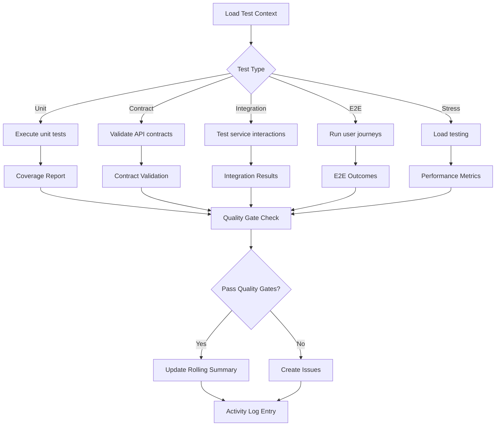

# qa-testing.skill

**Target Agent**: tech-lead-orchestrator, qa-orchestrator
**Purpose**: Comprehensive quality assurance across all testing levels with dynamic test selection.

## Dynamic Test Configuration
```yaml
Test Matrix:
  Levels: [unit, integration, contract, e2e, stress]
  Auto-Execute: {{auto-testing-enabled}}
  Coverage Target: {{coverage-percentage}}%
  Environment: {{test-environment}}
```

## Test Type Triggers
| Test Type | When to Execute | Priority | Auto-Run |
|---|---|---|---|
| **Unit Testing** | Code changes, component updates | **HIGH** | ✅ |
| **Contract Testing** | API changes, service interfaces | **HIGH** | ✅ |
| **Integration Testing** | Service dependencies, database | MEDIUM | 🔍 |
| **E2E Testing** | User workflows, critical paths | MEDIUM | 🔍 |
| **Stress Testing** | Performance requirements, scaling | LOW | ⚡ |

## Required Parameters
| Parameter | Description | Example |
|---|---|---|
| `task_reference` | Task ID or slug | `2025-demo` |
| `test_scope` | Testing level(s) to execute | `unit,contract` or `all` |
| `test_target` | Component/service to test | `billing-service` |
| `quality_gates` | Pass criteria | `coverage>90%, latency<200ms` |

## Optional Parameters
- `test_environment` - Test environment (dev/staging/prod)
- `performance_baseline` - Performance metrics to compare against
- `test_data` - Specific test data requirements
- `rollback_test` - Include rollback testing

## Dynamic Execution Flow


## Output Templates
### Test Results Summary
```
Test Execution Summary
- Scope: {{test-scope}}
- Target: {{test-target}}
- Environment: {{test-environment}}
- Timestamp: {{execution-time}}

Results by Level:
✅ Unit Tests: {{pass}}/{{total}} (Coverage: {{coverage}}%)
✅ Contract Tests: {{pass}}/{{total}} (All contracts valid)
✅ Integration Tests: {{pass}}/{{total}} (Services communicating)
✅ E2E Tests: {{pass}}/{{total}} (User journeys working)
⚡ Stress Tests: {{pass}}/{{total}} (Performance: {{metrics}})

Quality Gates: {{status}}
Issues Found: {{issue-count}} ({{severity-breakdown}})
```

### Rolling Summary Update
```
Context: {{updated-testing-context}}
Facts: Test execution {{status}}, coverage {{coverage}}%, {{critical-findings}}
Decisions: Go/No-Go decision based on quality gates
Risks: {{identified-risks}} with mitigation plans
Next: {{immediate-next-actions}}
```

## Dynamic Quality Gates
```yaml
Gate Configuration:
  Unit Tests:
    Coverage: ">{{min-coverage}}%"
    Pass Rate: 100%
  Contract Tests:
    API Compatibility: 100%
    Schema Validation: 100%
  Integration Tests:
    Service Connectivity: 100%
    Data Flow: ">{{success-rate}}%"
  E2E Tests:
    Critical Paths: 100%
    User Journey: ">{{success-rate}}%"
  Stress Tests:
    Response Time: "<{{max-latency}}ms"
    Throughput: ">{{min-tps}} tps"
    Error Rate: "<{{max-error-rate}}%"
```

## Quality Standards
- **🎯 Coverage Requirements**: Meet minimum coverage thresholds per level
- **📊 Performance Baselines**: Compare against established performance metrics
- **🔧 Issue Classification**: Categorize findings by severity (Blocker/Major/Minor)
- **📋 Evidence Collection**: Embed all test evidence in task file
- **🔄 Continuous Monitoring**: Track quality trends over time

## Dynamic Features
- **🤖 Auto-Test Selection**: Choose relevant tests based on changes
- **📈 Performance Tracking**: Monitor performance degradation/improvement
- **🎯 Adaptive Thresholds**: Adjust quality gates based on risk level
- **🔄 Parallel Execution**: Run multiple test types simultaneously
- **📊 Smart Reporting**: Generate insights from test results

## Example Usage
```
task_reference: 2025-demo
test_scope: all
test_target: billing-service
quality_gates: [coverage>90%, latency<200ms, error_rate<0.1%]
test_environment: staging
performance_baseline:
  response_time: 150ms
  throughput: 1000 tps
```

## Success Criteria
- All specified quality gates passed
- Test coverage meets or exceeds targets
- Performance metrics within acceptable ranges
- Critical issues resolved or documented with mitigation plans
- Clear Go/No-Go decision provided