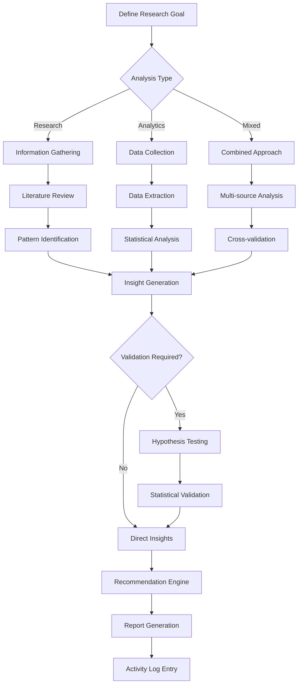

# research-analysis.skill

**Target Agent**: Any agent requiring research or analytics
**Purpose**: Unified research and analytics with dynamic methodology selection and intelligent insights.

## Dynamic Analysis Configuration
```yaml
Analysis Mode: {{analysis-type}}  # research/analytics/mixed
Data Sources: {{available-sources}}
Insight Level: {{depth-level}}  # basic/standard/comprehensive
Auto-Discovery: {{auto-discovery-enabled}}
```

## Research & Analytics Matrix
| Analysis Type | When to Use | Priority | Auto-Execute |
|---|---|---|---|
| **Market Research** | Competitive analysis, market trends | MEDIUM | 🔍 |
| **User Research** | User behavior, feedback analysis | MEDIUM | 📊 |
| **Data Analytics** | Metrics analysis, hypothesis testing | **HIGH** | 📈 |
| **Technical Research** | Patterns, benchmarks, feasibility | MEDIUM | 🔧 |
| **Trend Analysis** | Performance, usage over time | LOW | 📉 |

## Required Parameters
| Parameter | Description | Example |
|---|---|---|
| `task_reference` | Task ID or slug | `20251013-onboarding-funnel` |
| `research_goal` | Primary research question | `Validate KYC automation impact` |
| `analysis_type` | research/analytics/mixed | `analytics` |
| `data_sources` | Available data sources | `warehouse, analytics, user_logs` |

## Optional Parameters
- `hypotheses` - Specific hypotheses to test
- `time_window` - Analysis time period
- `segments` - Data segments to analyze
- `confidence_level` - Statistical confidence required
- `visualization_needs` - Chart/graph requirements

## Dynamic Research Framework


## Intelligent Analysis Engine
```yaml
Analysis Pipeline:
  1. Data Ingestion:
    Sources: {{data-sources}}
    Quality Check: {{data-quality-score}}
    Cleaning Applied: {{cleaning-operations}}

  2. Pattern Recognition:
    Statistical Methods: {{methods-used}}
    Machine Learning: {{ml-models-applied}}
    Anomaly Detection: {{anomalies-found}}

  3. Insight Generation:
    Key Findings: {{finding-count}}
    Confidence Level: {{confidence}}%
    Business Impact: {{impact-assessment}}

  4. Recommendation Engine:
    Actions Suggested: {{recommendation-count}}
    Priority Ranking: {{priority-framework}}
    Implementation Effort: {{effort-estimate}}
```

## Output Templates
### Research & Analytics Report
```
Research & Analytics Summary
Goal: {{research-goal}}
Type: {{analysis-type}}
Timestamp: {{analysis-time}}
Confidence: {{confidence}}%

Data Sources Analyzed:
- {{source-1}}: {{records-processed}} records
- {{source-2}}: {{records-processed}} records
- {{source-3}}: {{records-processed}} records

Key Findings:
📊 {{finding-1}} (Impact: {{impact}}, Confidence: {{confidence}}%)
📈 {{finding-2}} (Impact: {{impact}}, Confidence: {{confidence}}%)
🔍 {{finding-3}} (Impact: {{impact}}, Confidence: {{confidence}}%)

Hypothesis Testing:
- {{hypothesis-1}}: {{result}} (p-value: {{p-value}})
- {{hypothesis-2}}: {{result}} (p-value: {{p-value}}})

Recommendations:
🎯 {{recommendation-1}} (Priority: {{priority}}, Effort: {{effort}})
🎯 {{recommendation-2}} (Priority: {{priority}}, Effort: {{effort}})

Next Actions:
- {{action-1}} (Owner: {{owner}}, Due: {{date}})
- {{action-2}} (Owner: {{owner}}, Due: {{date}}})

Data Quality: {{quality-assessment}}
Methodology: {{methods-used}}
Limitations: {{analysis-limitations}}
```

### Rolling Summary Update
```
Context: {{updated-research-context}}
Facts: {{key-findings}}, {{confidence-level}} confidence, {{data-points}} analyzed
Decisions: Research-backed decisions with {{evidence-type}}
Risks: {{research-limitations}} and {{data-quality-risks}}
Next: {{recommended-research-actions}}
```

## Dynamic Insight Categories
```yaml
Insight Types:
  🔍 Descriptive: What happened?
  📊 Diagnostic: Why did it happen?
  📈 Predictive: What will happen?
  🎯 Prescriptive: What should we do?

Confidence Levels:
  High (≥90%): Strong statistical evidence
  Medium (70-89%): Good evidence, some limitations
  Low (<70%): Limited evidence, more research needed

Impact Assessment:
  Critical: Direct business impact
  High: Significant operational impact
  Medium: Moderate impact
  Low: Minor impact
```

## Quality Standards
- **📊 Evidence-Based**: All conclusions supported by data
- **🔍 Methodological Rigor**: Appropriate statistical methods
- **📈 Transparency**: Clear methodology and limitations
- **🎯 Actionable Insights**: Practical recommendations
- **🔄 Validation**: Hypothesis testing where appropriate

## Dynamic Features
- **🤖 Smart Source Discovery**: Automatically identify relevant data sources
- **📊 Intelligent Visualization**: Auto-generate appropriate charts
- **🔍 Pattern Recognition**: AI-powered insight detection
- **📈 Predictive Analytics**: Forecast based on historical data
- **🎯 Recommendation Engine**: Context-aware suggestions

## Example Usage
```
task_reference: 20251013-onboarding-funnel
research_goal: Validate KYC automation impact on completion rates
analysis_type: analytics
data_sources: [warehouse.prod.kyc_events, analytics_dashboard.kyc_conversion]
hypotheses:
  - H1: Automation reduces drop-off by 40%
  - H2: Mobile users benefit most from automation
time_window: 2025-07-01 to 2025-09-30
confidence_level: 95%
segments: [device_type, geography, user_segment]
```

## Success Criteria
- Research questions answered with appropriate methodology
- Insights supported by valid data and statistical analysis
- Recommendations are actionable and evidence-based
- Limitations and assumptions clearly documented
- Clear next steps with owners and timelines provided